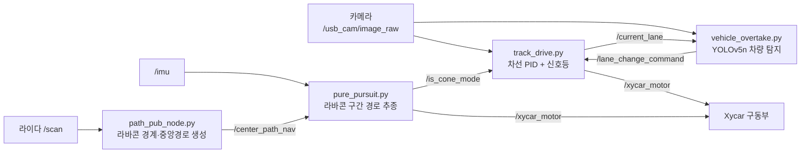

<div align="center">

# 🚗 Kookmin SDV — Xycar 자율주행 예선 주행 코드

**국민대학교 SDV(Self-Driving Vehicle) 자율주행 경진대회 예선 출전 코드**

카메라 기반 차선 추종, 라이다 기반 라바콘 회피, YOLOv5 기반 전방 차량 추월, 신호등 인식까지 — Xycar 한 대로 예선 미션 전체를 처리한 ROS1 주행 스택입니다.

[](http://wiki.ros.org/)
[](https://www.python.org/)
[](https://opencv.org/)
[](https://github.com/ultralytics/yolov5)
[](https://xytron.co.kr/)

</div>

---

## 📋 목차

- [개요](#-개요)
- [시스템 아키텍처](#-시스템-아키텍처)
- [노드별 설명](#-노드별-설명)
- [결과 영상](#-결과-영상)
- [예선 회고 — 추월 로직 하드코딩](#-예선-회고--추월-로직-하드코딩)
- [본선 회고 — 비전 단독 차선 추종의 벽](#-본선-회고--비전-단독-차선-추종의-벽)
- [실행 방법](#-실행-방법)

---

## 📖 개요

국민대학교 SDV 자율주행 경진대회 **예선**에 출전한 Xycar 주행 코드입니다. 이 대회는 GPS 없이 실내 트랙에서 진행되어, 팀에서 평소 주로 쓰던 GPS/오도메트리 기반 전역·지역 경로 추종 대신 **카메라·라이다만으로 인지부터 제어까지** 처리해야 했습니다.

- 🎥 **차선 추종** — HSV 색공간 + Hough 변환으로 흰색/노란색 차선을 검출하고, 곡률·신뢰도에 따라 게인이 바뀌는 적응형 PID로 조향
- 🚧 **라바콘 회피** — 라이다 점군에서 좌우 라바콘 경계를 그리디하게 이어붙여 중앙 경로를 생성하고 Pure Pursuit + PID로 추종
- 🚙 **전방 차량 추월** — YOLOv5n으로 전방 차량을 탐지해 반대 차선으로 차선 변경 명령을 발행
- 🚦 **신호등 인식** — HSV 기반 적색/녹색 픽셀 비율로 신호 상태 판단, 프레임 디바운스로 오검출 억제

## 🧭 시스템 아키텍처



라바콘 구간에 진입하면 `pure_pursuit.py`가 `/is_cone_mode`를 `true`로 발행해 `track_drive.py`의 차선 추종을 일시 정지시키고 주도권을 가져가며, 경로 수신이 2초 이상 끊기면 라바콘 구간이 끝난 것으로 판단해 5초간 고정 우회전 후 다시 차선 추종에 제어권을 돌려줍니다.

## 🧠 노드별 설명

<details open>
<summary><b>track_drive.py — 차선 추종 + 신호등 (메인 주행 노드)</b></summary>

- HSV로 흰색(`left_white`/`right_white`)·노란색(중앙선) 차선을 분리하고, Hough 변환으로 직선을 검출해 차선 위치를 추정
- 노란 중앙선 또는 양쪽 흰 차선 간격을 보고 현재 주행 차선(`left`/`right`)을 자동 판단
- 곡률(`current_curvature`)에 따라 P/D 게인을, 차선 신뢰도(`confidence`)에 따라 I 게인을 조정하는 **적응형 PID**로 조향각 산출
- 곡률·조향각·신뢰도·신호등·장애물 상태를 종합한 **비선형 속도 계산**(`calculate_adaptive_speed`)으로 커브에서도 과감하게, 신뢰도가 낮을 때만 감속
- `/lane_change_command`를 받으면 **3단계 차선 변경**(주회전 → 반대 카운터 스티어 → 직진 안정화)을 상태 머신으로 수행
- 상단 ROI의 적/녹 픽셀 비율로 신호등을 판단하고, 연속 프레임 임계치(`light_threshold`)로 디바운스

</details>

<details open>
<summary><b>path_pub_node.py — 라바콘 경계·중앙경로 생성</b></summary>

- 라이다 스캔을 전방(x>0) 점군으로 변환하고, 로봇과 가까우면서 좌우 폭이 적당한 라바콘 쌍을 시작점으로 탐색(거리 기준을 1.0m → 3.0m → 5.0m로 단계적으로 완화)
- 시작 라바콘부터 "거리 + 각도 변화 페널티" 점수가 가장 좋은 다음 점을 그리디하게 이어붙여 좌/우 경계선을 확장
- 좌우 경계의 중점으로 중앙 경로를 만들고 B-spline(`splprep`/`splev`)으로 부드럽게 보간, RViz 마커와 `/center_path_nav`(`nav_msgs/Path`)로 발행

</details>

<details open>
<summary><b>pure_pursuit.py — 라바콘 구간 경로 추종</b></summary>

- `/center_path_nav` 수신 시 `/is_cone_mode`를 `true`로 발행해 `track_drive.py`의 차선 추종을 정지시키고 제어권을 가져옴
- Lookahead 1.5m 기준으로 목표점을 찾아 Pure Pursuit 공식으로 조향각을 계산한 뒤, 그 위에 PID를 한 번 더 얹어 조향 명령을 보정
- 경로가 2초 이상 갱신되지 않으면 라바콘 구간이 끝난 것으로 보고 5초간 고정 우회전(`angle=-50`)을 수행한 뒤 `/is_cone_mode`를 `false`로 돌려 차선 추종에 제어권을 반환

</details>

<details open>
<summary><b>vehicle_overtake.py — YOLOv5 기반 전방 차량 추월</b></summary>

- `torch.hub.load('ultralytics/yolov5', 'yolov5n', pretrained=True)`로 YOLOv5n을 불러와 car/motorcycle/bus/truck 클래스만 탐지
- 바운딩 박스 폭과 초점거리·실제 차폭 가정치로 거리(m)를 추정하고, 화면 중앙 기준선과 겹치는 차량만 "전방 차량"으로 판단
- 전방 차량이 `detection_threshold`(2프레임) 이상 연속 감지되면 **딱 한 번** 반대 차선으로 `/lane_change_command`를 발행하고, 고정 `wait_duration`(9초) 뒤 원래 차선으로 복귀 명령을 한 번 더 발행 — 이후 `mission_complete` 플래그로 완전히 종료 ([아래 회고](#-예선-회고--추월-로직-하드코딩) 참고)

</details>

<details>
<summary><b>traffic_light.py — 보조 신호등 인식 유틸리티</b></summary>

- `track_drive.py`와 별개로 동작하는 단순 HSV 기반 신호등 인식 스크립트로, `traffic_is_go`/`traffic_is_stop`(Int32)를 발행
- 메인 주행 파이프라인에는 연결되어 있지 않은 독립 테스트/디버그용 노드

</details>

## 🎬 결과 영상

예선 최종 주행 영상(`두냔냥_과제1_최종동영상.mp4`, 약 447MB)은 git 저장소 용량 제한 때문에 커밋하지 않고 **GitHub Release**에 첨부했습니다.

▶ **[예선 최종 주행 영상 다운로드](https://github.com/sunmaan22/Kookmin_SDV/releases)**

## 🔍 예선 회고 — 추월 로직 하드코딩

`vehicle_overtake.py`의 추월 로직은 사실상 **타이머 기반 오픈루프**입니다.

- 전방 차량을 2프레임 연속 감지 → 반대 차선으로 변경 명령 1회 발행 → **고정 9초 대기** → 원래 차선 복귀 명령 1회 발행 → `mission_complete = True`로 영구 종료
- 9초 동안은 그 차량이 실제로 얼마나 멀어졌는지, 다시 안전하게 복귀할 수 있는지를 전혀 확인하지 않습니다. 대회 트랙의 상대 속도 조건이 조금만 달라져도 너무 일찍 끼어들거나 필요 이상으로 오래 반대 차선에 머무를 수 있는 구조입니다.
- 또한 미션이 전체 주행에서 **딱 한 번만** 실행되도록 잠겨 있어, 추월 대상 차량이 여러 대이거나 트랙을 여러 바퀴 도는 상황에는 대응할 수 없습니다.

**개선 방향**

1. **닫힌 루프 복귀 판단** — 9초 고정 대기 대신, YOLO로 추월 대상 차량을 계속 추적해 그 차량의 바운딩 박스가 자기 차 뒤쪽(화면 하단·측면)으로 충분히 벗어났을 때 복귀 명령을 내리도록 변경
2. **반대 차선 안전 확인** — 차선 변경 전에 반대 차선 쪽에 다른 차량이 없는지 확인하는 게이팅 로직 추가 (현재는 무조건 진입)
3. **원샷 제한 제거** — `mission_complete` 단일 플래그 대신 재진입 가능한 상태 머신으로 바꿔, 여러 번의 추월 상황에도 대응
4. **거리 추정 보정** — 모든 차량에 동일한 `real_car_width = 1.8m`를 가정한 핀홀 근사 대신, 클래스별(승용차/트럭/버스) 폭을 다르게 적용하거나 라이다 거리와 융합

## 🔍 본선 회고 — 비전 단독 차선 추종의 벽

팀에서 평소 다루던 자율주행 방식은 **GPS/IMU로 전역 경로(global path)를 만들고, 오도메트리 기반 지역 경로(local path)를 Pure Pursuit로 추종**하는 구조였습니다 ([FMA_2025 프로젝트](https://github.com/sunmaan22/FMA_2025) 참고). 반면 본선에서는 GPS 없이 **카메라 영상만으로 차선을 추적하고 제어**해야 하는 미션이 주어졌는데, 이런 방식은 이번이 처음이라 대응하지 못하고 실패했습니다.

- 예선까지는 라바콘 구간의 라이다 경로 추종과 짧은 구간의 차선 유지 정도만 비전에 의존했지만, 본선은 **주행의 처음부터 끝까지 비전 하나로만** 버텨야 했습니다.
- HSV 임계값이나 PID 게인은 예선 트랙 조명·바닥 재질에 맞춰 튜닝된 값이었고, 본선 환경(조명, 트랙 폭, 커브 곡률)에 대한 사전 검증이 부족했습니다.
- 무엇보다 GPS/오도메트리 기반 경로 추종에 익숙했던 팀에게 **비전 단독 제어는 처음 시도하는 방식**이었고, 실전에서 처음 붙여보는 셈이라 튜닝할 시간도, 실패 시 대체 전략도 없었습니다.

**다음에 적용할 개선 방향**

1. GPS 유무와 무관하게 항상 **비전 기반 차선 추종을 기본 옵션으로 함께 준비**해, 특정 경로 방식에만 의존하지 않기
2. 조명·바닥 재질이 다른 여러 환경에서 HSV 임계값과 PID 게인을 사전에 검증하는 **환경 강건성 테스트**를 대회 전 루틴에 포함
3. GPS/오도메트리 기반 경로와 비전 기반 차선 추종을 **상황에 따라 전환하거나 융합**할 수 있는 이중 구조를 사전에 설계해두기

## 🛠 실행 방법

이 저장소는 개별 노드 스크립트만 포함하며, 별도의 launch 파일이나 catkin 패키지 메타데이터는 포함하지 않습니다. Xycar 기본 ROS 패키지(`usb_cam`, `xycar_lidar`, `xycar_motor` 등)가 이미 구동 중인 상태에서, 필요한 노드를 개별 실행합니다.

```bash
# 차선 추종 + 신호등 (메인 주행)
rosrun <package> track_drive.py

# 라바콘 구간 진입 시 함께 실행
rosrun <package> path_pub_node.py
rosrun <package> pure_pursuit.py

# 전방 차량 추월 (YOLOv5n은 최초 실행 시 자동 다운로드됨)
rosrun <package> vehicle_overtake.py
```
